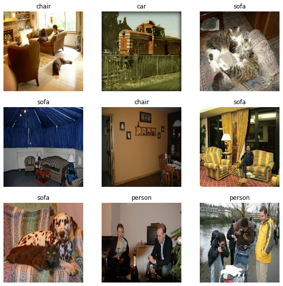
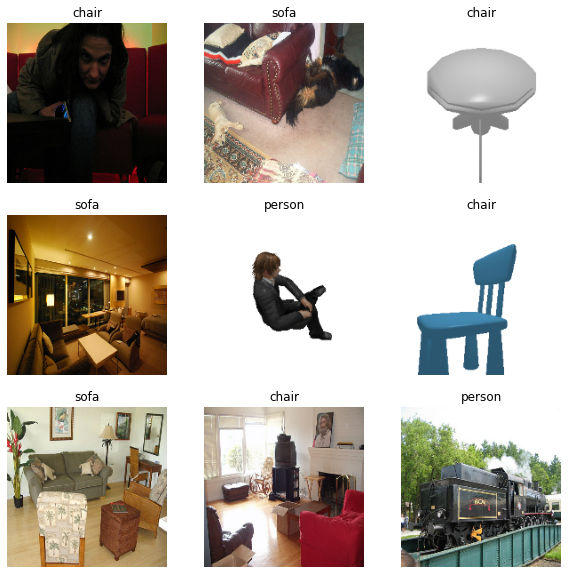
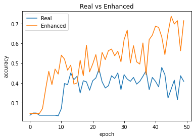

# Generate datasets for image recognition systems from 3D models
Enhance existing datasets with synthetic data to improve accuracy of your models.
Or simply create new datasets from scratch and focus on your model instead of looking out for data.

### Functionality
Convert 3D (.obj, .stl and .off) models to images for image recognition/classification systems. 
Software renders each model from different camera elevation angle, distance,rotation and color of the object.
Subfolders of input folder with 3D data will be used as labels and exported in .json format.

### UI
***Loading 3D files***\

***Generating dataset***\

***Output folder***\

***Labels sample***\

### Using synthetic data in image classification system
***Example of mixing real data with synthetic generated with SynDatGen***

**Real dataset**\
Sample data set from VOC2012\
About 500 images for each class\
\
**Enhanced dataset**\
Dataset has been enhanced with SynDatGen\
\
**Results**\
Relusts of enhacing dataset with synthetic data\
\
**Full experiment**\
Experiment can be reproduced and validated here:\
[Colab Experiment](https://colab.research.google.com/drive/1SaZaPVJGgoNMRPobCiwJ9i-LG4hbE2Ti)

### Colab Version
Run in Google Colab if you don't have a powerful GPU
[SynDatGen Colab Version](https://colab.research.google.com/drive/1gbUGjm5ZAXtcPgERu9FR2jAYC16dpSA0)

### PRO VERSION
Pro version with GUI and multiporcessing support is avaliable at [Tomahawk Software Solutions](https://tomahawk-software.solutions)\
Free for Educational Institutions and students!
